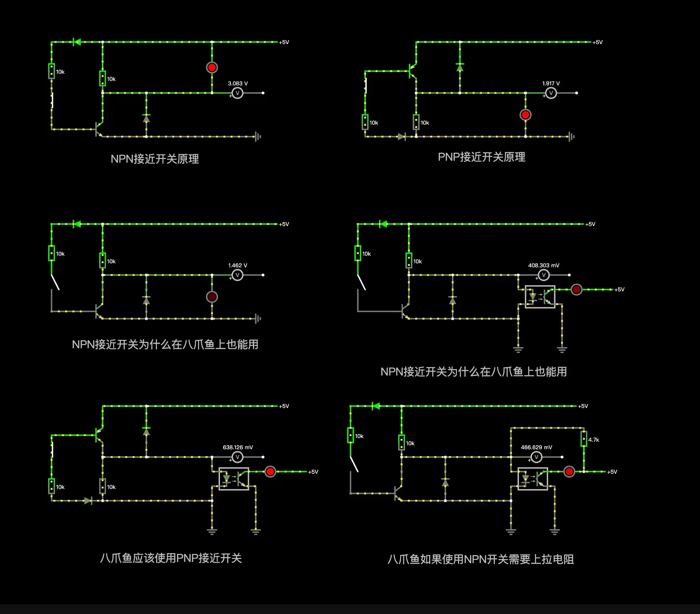
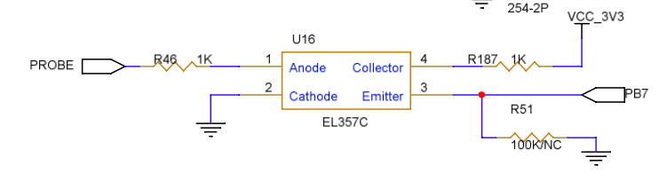

# 大鱼 TT 增强包

## 关于本项目

`大鱼TT` 是 B 站 UP`大鱼DIY`在 2023 年发布的一款 CoreXY 结构的开源 3D 打印机方案。

大家都习惯把资料在 QQ 群里讨论分享，但是不方便检索，所以我创建了这个项目，把组装过程中用到的资源，一点点收集到这里。同时也欢迎其他机友补充和提交资料。

### 简单分享下我这个零基础小白在装机过程中遇到的坑。

前前后后半个多月，学到了很多知识，感谢大鱼 DIY 给我们带来的这款大鱼 TT，感谢群里曾经帮助过我的各位朋友。

首先说 BOM 表。本来是想一键下单的，但是由于产能原因，有些店铺没货。没办法只能自己照单抓药一个个在各种店铺下单买，单品型号可能有一些差异，于是遇到了一些奇奇怪怪的问题。

我有一个树莓派 3b，装了 LED3.5 触摸屏，一直闲着。所以就打算用 BOM 里提到的树莓派+八爪鱼的方案。后来我才知道大鱼他是用小政主板做的，兼容性会比较好。八爪鱼主板遇到的一些问题基本上都是在大鱼群和八爪鱼的群里各位大佬的帮助下解决的，在这里再次表示感谢。

然后说说“拓竹”的挤出机，是所谓的 2.0 版本，尾端和散热块的地方有螺丝片加固的那款，风扇固定需要两颗 M2.5\*16 的螺丝，这个 BOM 里没有提。

再就是接近开关。一开始我是用的 BOM 链接买的 24V 的 NPN 接近开关，配的八爪鱼 1.1 主板。这个主板端是 PNP 的，所以 24V 的 NPN 不能直接用，除非自己接个下拉电阻，我不会。听说 Pro 的板子可以用 NPN。于是我又买了一块八爪鱼 Pro，实测发现即使接了 NPN 跳脚，也不能用。后来我买了一个 5V 的 NPN 常闭，可以在 1.1 和 Pro 上用，需要在 Pin 前面加上“~”。

~~关于这个接近开关问题我多提点吧，毕竟当时卡了我好几天。先说 24VNPN 的时候，我分别测试了 24V，12V，5V。在 24V 时接触金属 5.8V，不接触 3V。在 12V 时，接触金属 2.xV，不接触 1.2V。那我猜在 5V 时，接触金属应该 1.xV，不接触金属 0.xV，就可以一个 1 一个 0 两个电平形成开关信号了吧？可惜这个接近开关的额定电压是 6V-36V，在 5V 下不工作。后来我购买了 5V 的 NPN 证实了这一猜测。至于背后的原理，等我回头复习一下电路知识，重新整理。这里做个备忘。~~

6 张图来弄明白为什么八爪鱼 1.1 主板不能直接用 NPN 的接近开关，和如何解决这个问题。

图一、图二分别是 NPN 接近开关和 PNP 接近开关的原理。
通过查看八爪鱼 1.1 的电路图得知，如图四那样，接近开关的信号引脚和 GND 接了一个光耦开关。通过图三可以看到，NPN 接近开关信号引脚和 GND 之间电压很低，所以不能完全打开光耦。

看八爪鱼的原理图，100K 下拉电阻是 NC 状态，也就没有焊。所以需要加  ~  来内部下拉，也就是 ~PB7。当光耦不能完全打开时，~PB7 的电压高低跳变就可能不稳定，所以表现出来就是不能工作或者测量不准确。具体的情况就需要看具体型号的接近开关的额定电压情况了。

所以我们应该用 PNP 型接近开关 或者 NPN 接近开关把信号引脚接一个上拉电阻。

~~2023 年 10 月 16 日 00:20:50 获得的好消息，24V NPN 接近开关可以在八爪鱼上使用了，接线方法：正负极接电源正负极，信号 PIN 还是接 Probe 的信号 PIN 就可以用了~~

接近开关的热飘非常明显，首层打印不稳定，所以后来我决定试试 Klicky 方案。Klicky 的开源方案有很多，我是用的 https://github.com/tanaes/whopping_Voron_mods/tree/main/pcb_klicky 的方案。停靠坞使用 MG90s/SG90 舵机，（不要用 MG996 等大电流舵机，主板带不动）。我单独开一篇来分享一下 Klicky+舵机的配置过程。

还有各种电线，是否用 CanBus，XH2.54 的端子等等细节问题。太碎了，实在是懒得一条条列举了，而且我相信列出来大家也未必一条条仔细看。还是有啥问题去群里问各位网友吧。

对了还有那个热床 MOS，如果不是大功率的热床，不需要买的。
